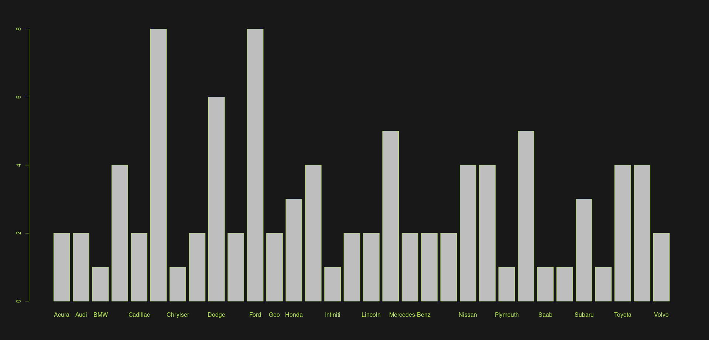
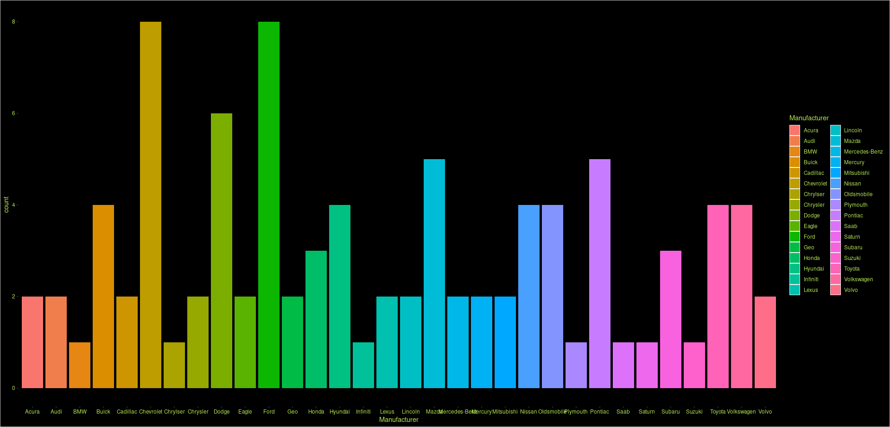
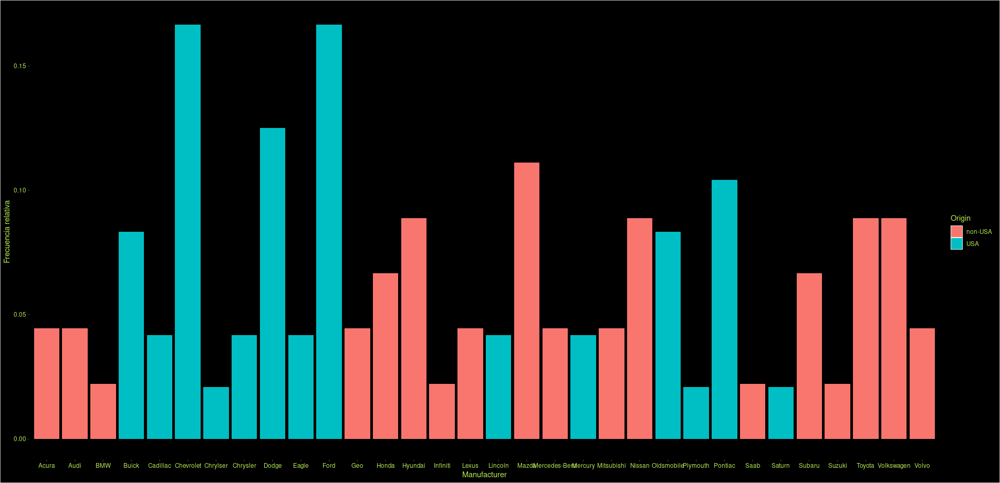
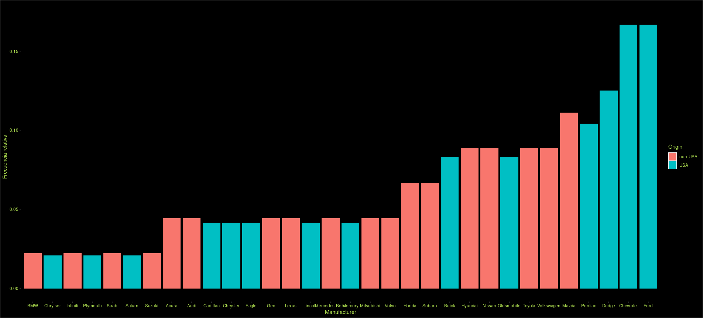
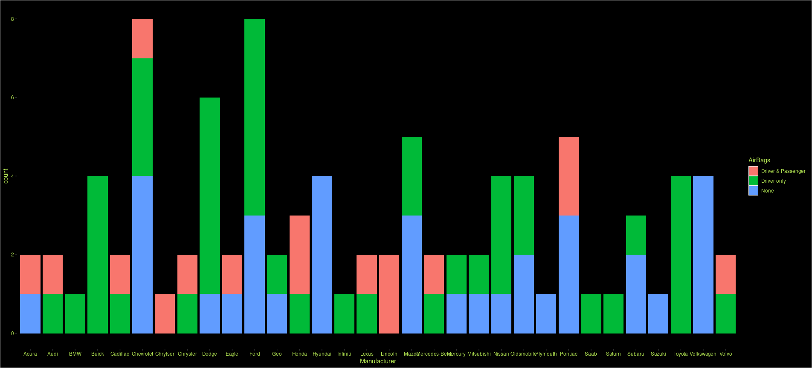
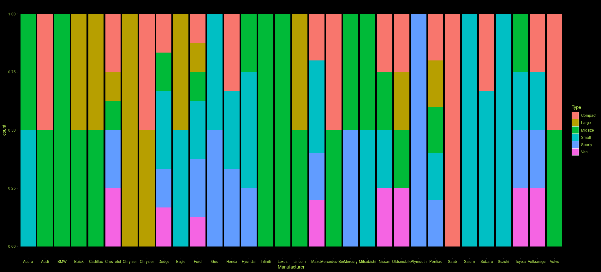
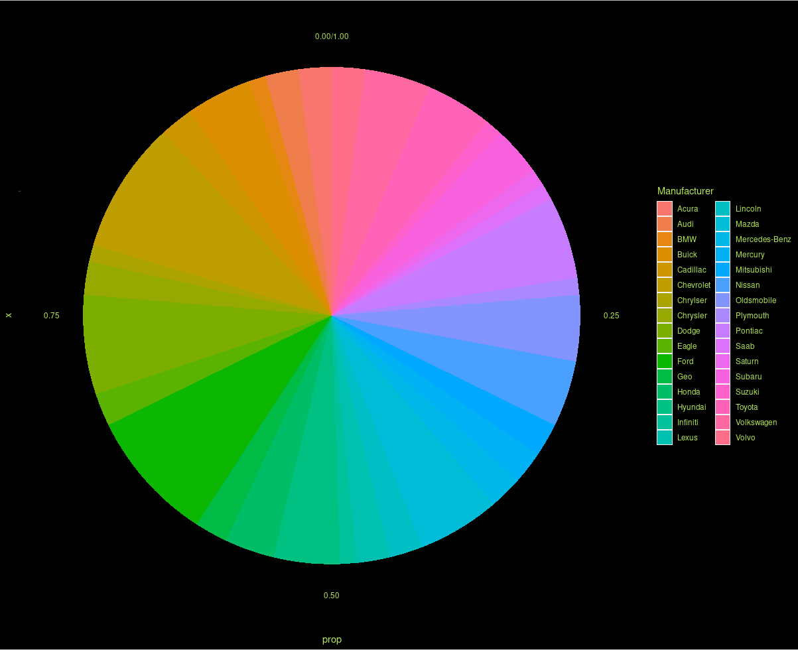
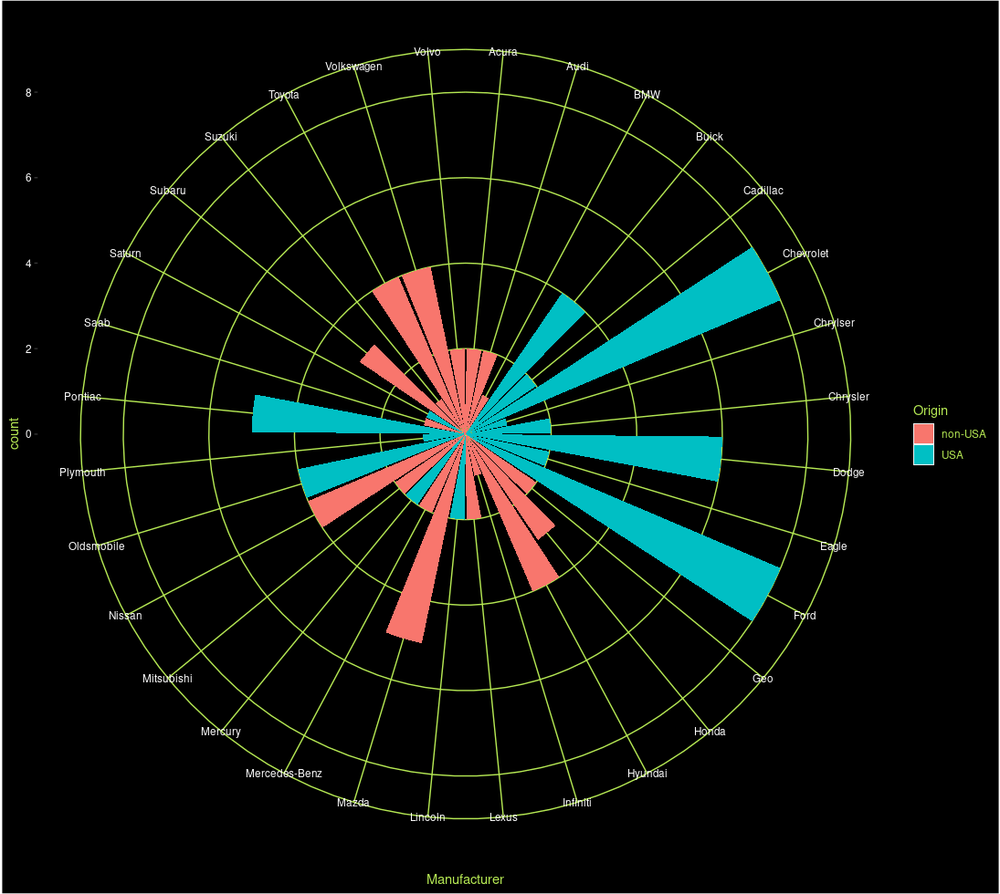
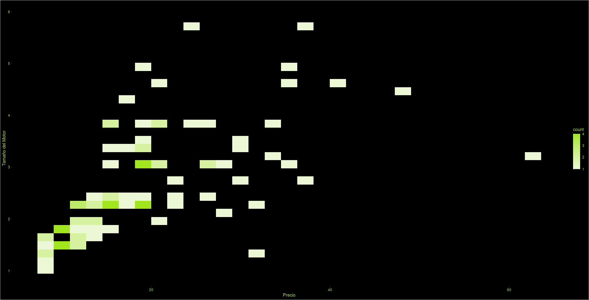

# Análisis exploratorio de datos con R: Estudio de caso en una base de datos de carros del año 1999

## Introducción
Este artículo se enfoca en un análisis exploratorio de datos realizado en una base de datos de carros del año 1999 utilizando el lenguaje de programación R. En él se describen los pasos necesarios para instalar los paquetes necesarios, cargar los datos, realizar análisis de frecuencia y visualizaciones utilizando las librerías ggplot2, y tabular y calcular medidas de tendencia central y variabilidad. Este tipo de análisis puede ser útil en la identificación de patrones y tendencias en los datos, lo que puede ayudar a tomar decisiones informadas en distintos ámbitos.

## Instalación de paquetes necesarios
* La función install.packages("MASS") se utiliza para instalar el paquete MASS. Esta función descarga e instala el paquete en la biblioteca de R.
* Las funciones library() se utilizan para cargar los paquetes previamente instalados en la sesión actual. Los paquetes MASS, descr, ggplot2 y forcats se utilizan comúnmente en el análisis y visualización de datos.

```
install.packages("MASS")
library(MASS)
library(descr)
library(ggplot2)
library(forcats)
```

## Lectura del conjunto de datos
* Este comando lee un archivo CSV llamado "dataset-83422.csv" y lo carga en un objeto de R llamado "base_carros". El archivo CSV debe estar en la misma ubicación que el script de R desde donde se está ejecutando este comando. Una vez que se ha cargado el archivo CSV, se pueden realizar diversas operaciones en los datos utilizando el objeto "base_carros".

```
base_carros = read.csv("dataset-83422.csv")
```

[Ver Tabla](./TablaCars99.md)

## Frecuencias

### Frecuencia absoluta
* El código está calculando la frecuencia absoluta de la variable "Manufacturer" en un conjunto de datos llamado "base_carros". La función "table" crea una tabla de frecuencias para una variable dada, y en este caso, se está pasando como argumento la columna "Manufacturer" del conjunto de datos. La salida de este código es la tabla de frecuencias absolutas de la variable "Manufacturer", es decir, el número de veces que aparece cada valor de "Manufacturer" en el conjunto de datos.

```
frec_abs = table(base_carros$Manufacturer)
frec_abs
```

### Frecuencia relativa
* La función prop.table() en R se utiliza para calcular las frecuencias relativas de una tabla o matriz. En este caso, frec_abs es la tabla de frecuencias absolutas que se ha calculado previamente utilizando la función table(). La función prop.table(frec_abs) toma la tabla de frecuencias absolutas frec_abs y calcula las frecuencias relativas de cada valor en la tabla. El resultado es una tabla de frecuencias relativas que indica la proporción de veces que aparece cada valor en la variable.

```
frec_rel = prop.table(frec_abs)
frec_rel
```

### Tabla de frecuencias
* La función freq() pertenece al paquete descr y se utiliza para crear una tabla de frecuencias de una variable categórica. En este caso, se está aplicando esta función a la variable Manufacturer del conjunto de datos base_carros. Además, se especifica el argumento plot = TRUE para que se genere un gráfico de barras que muestre la distribución de frecuencias de la variable. La variable frec_tabla guarda el resultado de la función freq(), es decir, la tabla de frecuencias y el gráfico de barras.

```
par(col.axis = "#b5e853", bg="#000000e6", fg="#b5e853", col="#b5e853")
frec_tabla = freq(base_carros$Manufacturer, plot = TRUE)
frec_tabla
```
* #### Plot tabla de frecuencias


## Gráficas de barras *ggplot2*

### Gráfica de barras frecuencia absoluta
* Este código en R utiliza la librería ggplot2 para crear un gráfico de barras de las frecuencias absolutas de una variable cualitativa llamada Manufacturer en un conjunto de datos llamado base_carros. La función geom_bar se utiliza para crear un gráfico de barras, donde se define el mapeo de datos para el eje x, que en este caso es el nombre de los fabricantes, utilizando la función aes que toma como argumento x = Manufacturer. No se especifica la altura de cada barra, por lo que por defecto se muestra la frecuencia absoluta de cada fabricante.

```
ggplot(data = base_carros) + 
  geom_bar(mapping = aes(x = Manufacturer, fill=Manufacturer))+
  theme(panel.background = element_rect(fill = "#000000e6"),
        plot.background = element_rect(fill = "#000000e6"),
        panel.grid.major = element_line(color = "#000000e6"),
        panel.grid.minor = element_line(color = "#000000e6"),
        axis.text = element_text(color = "#b5e853"),
        axis.title = element_text(color = "#b5e853"),
        legend.background = element_rect(fill = "#000000e6"),
        legend.text = element_text(color = "#b5e853"),
        legend.title = element_text(color = "#b5e853"),)
```
* #### ggplot barras frecuencia absoluta


### Gráfica de barras frecuencia relativa
* Este código está generando un gráfico de barras con las frecuencias relativas de los fabricantes de los carros en función del país de origen del fabricante.

  * La función ggplot() establece el conjunto de datos base_carros como el origen de los datos para el gráfico.
  * La función geom_bar() se utiliza para crear un gráfico de barras y el parámetro mapping se utiliza para asignar las variables estéticas a las columnas del conjunto de datos. En este caso, el eje x representa el fabricante, el eje y representa la frecuencia relativa de los fabricantes, el parámetro fill se utiliza para asignar el país de origen de cada fabricante al color de la barra y el parámetro group se utiliza para agrupar los datos por país de origen.
  * La función theme() se utiliza para establecer los aspectos de la apariencia del gráfico, como el color de fondo, los colores de las líneas de la cuadrícula, los colores del texto de los ejes y el color de fondo de la leyenda.
  * La función labs() se utiliza para establecer los títulos de los ejes y de la leyenda. En este caso, el título del eje x es "Manufacturer", el título del eje y es "Frecuencia relativa" y el título de la leyenda es "Origin".

```
ggplot(data = base_carros) + 
  geom_bar(mapping = aes(x = Manufacturer, y = stat(prop), fill = Origin, group = Origin)) +
  theme(panel.background = element_rect(fill = "#000000"),
        plot.background = element_rect(fill = "#000000"),
        panel.grid.major = element_line(color = "#000000e6"),
        panel.grid.minor = element_line(color = "#000000e6"),
        axis.text = element_text(color = "#b5e853"),
        axis.title = element_text(color = "#b5e853"),
        legend.background = element_rect(fill = "#000000e6"),
        legend.text = element_text(color = "#b5e853"),
        legend.title = element_text(color = "#b5e853")) +
  labs(x = "Manufacturer", y = "Frecuencia relativa", fill = "Origin")
```

* #### ggplot barras frecuencia relativa


### Gráfica de barras frecuencia relativa ordenada por el número de caracteres en su nombre
* Este código genera una gráfica de barras que muestra la frecuencia relativa de los fabricantes de autos en la base de datos base_carros, ordenada por el número de caracteres en su nombre (usando la función fct_reorder del paquete forcats). Además, el color de las barras se define por la variable Origin de la base de datos. La leyenda correspondiente se agrega utilizando las funciones labs y theme, y se personalizan los colores del fondo, las líneas de la cuadrícula, los ejes y la leyenda.

* La advertencia que aparece indica que se eliminaron estéticas durante la transformación estadística, lo que podría deberse a una estructura de agrupación incorrecta en los datos. En este caso, es probable que la variable Origin no esté formateada correctamente como un factor en la base de datos.

```
ggplot(data = base_carros) + 
  geom_bar(mapping = aes(x = fct_reorder(Manufacturer,Manufacturer,length), y = stat(prop), fill = Origin, group = Origin)) +
  labs(x = "Manufacturer", y = "Frecuencia relativa", title = "Frecuencia relativa de fabricantes de autos") +
  theme(panel.background = element_rect(fill = "#000000"),
        plot.background = element_rect(fill = "#000000"),
        panel.grid.major = element_line(color = "#000000e6"),
        panel.grid.minor = element_line(color = "#000000e6"),
        axis.text = element_text(color = "#b5e853"),
        axis.title = element_text(color = "#b5e853"),
        legend.background = element_rect(fill = "#000000e6"),
        legend.text = element_text(color = "#b5e853"),
        legend.title = element_text(color = "#b5e853"))
```

* #### ggplot barras frecuencia relativa ordenados por el número de caracteres en su nombre


### Gráfica de barras frecuencia relativa y apila el tipo de airbag que utilizan
* Este código crea una gráfica de barras que muestra la frecuencia de fabricantes de autos en el eje x y el número de modelos que tienen bolsas de aire en el eje y. Cada barra está coloreada según si los modelos tienen o no bolsas de aire.

  * ggplot(data = base_carros) establece la fuente de datos para la gráfica como el dataframe base_carros.

  * geom_bar(mapping = aes(x = Manufacturer, fill = AirBags)) especifica que la gráfica tendrá barras y define dos mapeos estéticos: el eje x se asigna a Manufacturer y el relleno de las barras se asigna a AirBags.

  * theme(...) establece el tema de la gráfica. En este caso, establece el color de fondo, las líneas de la cuadrícula y los colores de los textos y de la leyenda.

```
ggplot(data = base_carros) + 
  geom_bar(mapping = aes(x = Manufacturer, fill = AirBags))+
  theme(panel.background = element_rect(fill = "#000000"),
        plot.background = element_rect(fill = "#000000"),
        panel.grid.major = element_line(color = "#000000e6"),
        panel.grid.minor = element_line(color = "#000000e6"),
        axis.text = element_text(color = "#b5e853"),
        axis.title = element_text(color = "#b5e853"),
        legend.background = element_rect(fill = "#000000e6"),
        legend.text = element_text(color = "#b5e853"),
        legend.title = element_text(color = "#b5e853"))
```

* #### ggplot barras frecuencia relativa apilando tipo de airbag


### Gráfica de barras proporcionales de fabricantes y tipos de automóvil
* Este código genera una gráfica de barras apiladas proporcionales que muestra la proporción de cada tipo de automóvil por fabricante en los datos de base_carros.

* En la función geom_bar, se utiliza el parámetro mapping para establecer la variable Manufacturer en el eje x y la variable Type en el relleno de las barras. El parámetro position se establece como "fill" para apilar las barras de manera proporcional en lugar de mostrarlas en paralelo.

* En la sección del tema, se establece el color de fondo del panel, la trama y las líneas de la cuadrícula, así como el color del texto de los ejes y la leyenda. También se establece el color de fondo de la leyenda y el color del texto de la leyenda.

```
# Gráfica proporcion
ggplot(data = base_carros) + 
  geom_bar(mapping = aes(x = Manufacturer, fill = Type), position = "fill")+
  theme(panel.background = element_rect(fill = "#000000"),
        plot.background = element_rect(fill = "#000000"),
        panel.grid.major = element_line(color = "#000000e6"),
        panel.grid.minor = element_line(color = "#000000e6"),
        axis.text = element_text(color = "#b5e853"),
        axis.title = element_text(color = "#b5e853"),
        legend.background = element_rect(fill = "#000000e6"),
        legend.text = element_text(color = "#b5e853"),
        legend.title = element_text(color = "#b5e853"))
```

* #### ggplot barras proporcionales de fabricantes y tipo de automóvil


## Gráficas circulares *ggplot2*

### Gráfica circular de proporcion de fabricantes
* Este código genera un gráfico circular (o gráfico de rosca) que muestra la proporción de fabricantes de autos en una base de datos llamada resumen_manufacturer, utilizando el paquete ggplot2 de R.

* La función ggplot() inicia el gráfico, y se le pasa como primer argumento el nombre de la base de datos que contiene los datos a graficar (resumen_manufacturer). Luego, se utiliza la función aes() para indicar que el eje x no tiene variable asociada (x = ""), el eje y representa la proporción de fabricantes (y = prop), y el color de las barras representa los diferentes fabricantes (fill = Manufacturer).

* A continuación, se utiliza la función geom_bar() para indicar que se quiere un gráfico de barras (stat = "identity"), y la función coord_polar() para transformar el gráfico de barras en uno circular. Finalmente, se utilizan las funciones theme() y sus parámetros para ajustar la apariencia del gráfico (fondo, colores, líneas, textos, leyendas, etc.).

```
ggplot(resumen_manufacturer, aes(x = "", y = prop, fill = Manufacturer)) +
  geom_bar(stat = "identity")  +
  coord_polar("y") +
  theme(panel.background = element_rect(fill = "#000000"),
        plot.background = element_rect(fill = "#000000"),
        panel.grid.major = element_line(color = "#000000e6"),
        panel.grid.minor = element_line(color = "#000000e6"),
        axis.text = element_text(color = "#b5e853"),
        axis.title = element_text(color = "#b5e853"),
        legend.background = element_rect(fill = "#000000e6"),
        legend.text = element_text(color = "#b5e853"),
        legend.title = element_text(color = "#b5e853"))
```

* #### ggplot circular porporcional de fabricantes


### Gráfica polar de frecuencia de fabricantes
* Este código genera un gráfico de barras apiladas y polar. El eje x representa los diferentes fabricantes de automóviles y el eje y muestra la frecuencia de los mismos. El color de las barras representa el origen del fabricante. La función coord_polar() transforma el gráfico para que sea polar. Los elementos de la temática (theme()) se encargan de definir el estilo visual del gráfico, como el color de fondo, los colores de las líneas, texto y leyenda.

```
ggplot(data = base_carros) + 
  geom_bar(mapping = aes(x = Manufacturer, fill= Origin)) +
  coord_polar()+
  theme(panel.background = element_rect(fill = "#000000"),
        plot.background = element_rect(fill = "#000000"),
        panel.grid.major = element_line(color = "#b5e853"),
        panel.grid.minor = element_line(color = "#b5e853"),
        axis.text = element_text(color = "#ffffff"),
        axis.title = element_text(color = "#b5e853"),
        legend.background = element_rect(fill = "#000000e6"),
        legend.text = element_text(color = "#b5e853"),
        legend.title = element_text(color = "#b5e853"))
```
* #### ggplot polar frecuencia de fabricantes


## Graficas histogramas

### Histogramas para 2 variables cuantitativas

* Este código utiliza la librería ggplot2 de R para generar un histograma 2D que muestra la distribución conjunta de las variables "Price" y "EngineSize" de la tabla "base_carros". La escala de color utilizada va desde el verde claro hasta el verde oscuro. Además, se utilizan opciones de formato para cambiar el color de fondo, la rejilla, los ejes y la leyenda, lo que permite mejorar la visualización del gráfico.

```
ggplot(base_carros, aes(x = Price, y = EngineSize)) + 
  geom_bin2d() +
  scale_fill_gradient(low = "#ebf7d5", high = "#a1e61e") +
  labs(title = "Histograma 2D de Precio y Tamaño del Motor", x = "Precio", y = "Tamaño del Motor")+
  theme(panel.background = element_rect(fill = "#000000"),
        plot.background = element_rect(fill = "#000000"),
        panel.grid.major = element_line(color = "#000000e6"),
        panel.grid.minor = element_line(color = "#000000e6"),
        axis.text = element_text(color = "#b5e853"),
        axis.title = element_text(color = "#b5e853"),
        legend.background = element_rect(fill = "#000000e6"),
        legend.text = element_text(color = "#b5e853"),
        legend.title = element_text(color = "#b5e853"))
```
* #### ggplot histograma de Precio y Tamaño del Motor


## Tabulación

### Tabulación cruzada de frecuencias

* Utiliza la función xtabs() para generar una tabla de contingencia a partir de las variables categóricas AirBags y DriveTrain.
* Utiliza la función prop.table() para calcular las frecuencias relativas por fila, por columna y por tabla.
* Convierte la tabla de contingencia en un data frame y utiliza la función pivot_longer() para convertir la tabla en formato "wide" a "long".
* Utiliza ggplot() y geom_tile() para generar un gráfico de mosaico a partir del data frame obtenido en el paso anterior.
* Define los ajustes estéticos y de tema para el gráfico generado.

```
# Tabulación cruzada con xtabs
tab <- xtabs(~ AirBags + DriveTrain, data = base_carros)

# Frecuencias relativas por fila
prop.row <- prop.table(tab, margin = 1)
print(prop.row)

# Frecuencias relativas por columna
prop.col <- prop.table(tab, margin = 2)
print(prop.col)

# Frecuencias relativas por tabla
prop.tbl <- prop.table(tab)
print(prop.tbl)

df <- as.data.frame(tab)
df <- pivot_longer(df, cols = c(Freq), names_to = "count", values_to = "value")

ggplot(df, aes(x = DriveTrain, y = AirBags, fill = value)) + 
  geom_tile(color = "#000000") +
  scale_fill_gradient(low = "#ebf7d5", high = "#a1e61e") +
  theme(axis.text.x = element_text(angle = 90, vjust = 0.5, hjust = 1), 
        panel.background = element_rect(fill = "#000000"),
        plot.background = element_rect(fill = "#000000"),
        panel.grid.major = element_line(color = "#000000e6"),
        panel.grid.minor = element_line(color = "#000000e6"),
        axis.text = element_text(color = "#b5e853"),
        axis.title = element_text(color = "#b5e853"),
        legend.background = element_rect(fill = "#000000e6"),
        legend.text = element_text(color = "#b5e853"),
        legend.title = element_text(color = "#b5e853")) +
  labs(x = "DriveTrain", y = "AirBags")

```

* #### ggplot gráfico de mosaico de AirBags y DriveTrain

* #### Frecuencias relativas por fila

| ↓ AirBags/DriveTrain → | 4WD        | Front      | Rear   |
|--------------------|------------|------------|------------|
| Driver & Passenger | 0.00000000 | 0.68750000 | 0.31250000 |
| Driver only        | 0.11627907 | 0.65116279 | 0.23255814 |
| None               | 0.14705882 | 0.82352941 | 0.02941176 |

  * El 68.75% de los vehículos con AirBags delanteros y traseros tienen tracción delantera, mientras que el 31.25% tienen tracción trasera.
  * El 82.35% de los vehículos sin AirBags tienen tracción delantera, el 14.71% tienen tracción trasera y el 2.94% tienen tracción en las cuatro ruedas.

* #### Frecuencias relativas por columna

| ↓ AirBags/DriveTrain → | 4WD        | Front  | Rear    |
|--------------------|------------|------------|---------|
| Driver & Passenger | 0.0000000 | 0.1641791 | 0.3125000 |
| Driver only        | 0.5000000 | 0.4179104 | 0.6250000 |
| None               | 0.5000000 | 0.4179104 | 0.0625000 |

  * El 50% de los vehículos con tracción en las cuatro ruedas tienen AirBags delanteros y traseros, mientras que el 50% no tienen AirBags.
  * El 82.35% de los vehículos con tracción delantera tienen AirBags, mientras que el 17.65% no tienen AirBags.
  * El 62.5% de los vehículos con tracción trasera no tienen AirBags, mientras que el 37.5% tienen AirBags.

* #### Frecuencias relativas por tabla

| ↓ AirBags/DriveTrain → | 4WD        | Front      | Rear   |
|--------------------|------------|------------|------------|
| Driver & Passenger | 0.00000000 | 0.11827957 | 0.05376344 |
| Driver only        | 0.05376344 | 0.30107527 | 0.10752688 |
| None               | 0.05376344 | 0.30107527 | 0.01075269 |

  * El 30.11% de todos los vehículos tienen AirBags delanteros y traseros y tracción delantera.
  * El 10.75% de todos los vehículos no tienen AirBags y tienen tracción trasera.
  * Solo el 5.38% de todos los vehículos tienen AirBags delanteros y traseros, tracción en las cuatro ruedas y ningún AirBags.

## Medidas de tendencia central o localización

### Media de caballos de fuerza *Horsepower*

* El comando mean(base_carros$Horsepower, na.rm=TRUE) es utilizado en el lenguaje de programación R para calcular la media aritmética de los valores numéricos de la columna 'Horsepower' en el objeto base_carros. El argumento na.rm=TRUE indica que se deben excluir los valores faltantes (NA) al calcular la media.

```
mean(base_carros$Horsepower, na.rm=TRUE)
```

### Media recortada de caballos de fuerza *Horsepower*

* El comando mean(base_carros$Horsepower, na.rm=TRUE, trim=0.1) también es utilizado en R para calcular la media aritmética de los valores numéricos de la columna 'Horsepower' en el objeto base_carros. En este caso, el argumento adicional trim=0.1 indica que se debe aplicar la media recortada al 10% para excluir el 10% de los valores atípicos (los más bajos y los más altos). Es decir, el 10% de los valores más bajos y el 10% de los valores más altos se excluyen del cálculo de la media. Los argumentos na.rm=TRUE y trim=0.1 juntos indican que los valores faltantes también se deben excluir del cálculo de la media recortada al 10%.

```
mean(base_carros$Horsepower, na.rm=TRUE, trim=0.1)
```

### Mediana de caballos de fuerza *Horsepower*

* El comando median(base_carros$Horsepower) es utilizado en R para calcular la mediana de los valores numéricos de la columna 'Horsepower' en el objeto base_carros. La mediana es el valor que se encuentra en el centro de una distribución ordenada de datos, es decir, el valor que divide a la mitad a los datos. En este caso, el comando calculará la mediana de los valores de potencia (Horsepower) de los carros en la base de datos.

```
median(base_carros$Horsepower)
```

### Moda de caballos de fuerza *Horsepower*

* Este código define una función en R llamada mode que calcula la moda de un vector numérico x. La función utiliza la función table() para contar el número de ocurrencias de cada valor en el vector, y luego encuentra el valor que tiene la frecuencia máxima utilizando la función which.max(). Finalmente, la función devuelve la moda en formato numérico.

* El comando mode(base_carros$Horsepower) utiliza la función mode() previamente definida para calcular la moda de los valores numéricos de la columna 'Horsepower' en el objeto base_carros. La moda es el valor que ocurre con mayor frecuencia en una distribución de datos.

```
mode <- function(x) {
  return(as.numeric(names(which.max(table(x)))))
}

mode(base_carros$Horsepower)
```

### Cuartiles de caballos de fuerza *Horsepower*

* El comando summary(base_carros$Horsepower) en R genera un resumen estadístico de la variable Horsepower en el objeto base_carros. El resumen estadístico incluye los siguientes valores:

  * El número de observaciones no faltantes (N)
  * La media aritmética (mean)
  * La mediana (50%)
  * El valor mínimo (Min)
  * El primer cuartil (25%)
  * El tercer cuartil (75%)
  * El valor máximo (Max)

* Este comando proporciona una descripción general de la distribución de la variable Horsepower en la base de datos.

```
summary(base_carros$Horsepower)
```

| Min  | 1st Qu | Median | Mean  | 3rd Qu | Max   |
|------|--------|--------|-------|--------|-------|
| 55.0 | 103.0  | 140.0  | 143.8 | 170.0  | 300.0 |

### Percentiles de caballos de fuerza *Horsepower*

* Este código calcula los percentiles 1, 5, 10, 90.95 y 99 de la variable Horsepower en la base de datos base_carros.

* La función quantile() en R se utiliza para calcular percentiles y cuartiles de un conjunto de datos. En este caso, la función recibe dos argumentos: el primer argumento es la variable de interés base_carros$Horsepower, y el segundo argumento es un vector numérico que especifica los percentiles que deseamos calcular. En este caso, el vector de probabilidades (probs) contiene los valores 0.01, 0.05, 0.10, 0.9095 y 0.99.

* Esto significa que la función quantile() calculará los valores correspondientes a los percentiles 1, 5, 10, 90.95 y 99 de la variable Horsepower. Los valores calculados serán devueltos como un vector que contiene los valores de los percentiles especificados en el mismo orden en que se especificaron.

```
quantile(base_carros$Horsepower, probs=c(0.01, 0.05, 0.10, 0.9095, 0.99))
```

| 1%     | 5%      | 10%    | 90.95%  | 99      |
|--------|---------|--------|---------|---------|
| 62.360 | 78.200  | 86.000 | 209.348 | 300.000 |

## Medidas de Variabilidad

### Rango tamaño del motor *EngineSize*

* Este código en R calcula el rango de la variable EngineSize en la base de datos base_carros.

* Primero, se utiliza la función min() para encontrar el valor mínimo de la variable EngineSize en la base de datos base_carros, y se guarda el resultado en la variable es_min. Luego, se utiliza la función max() para encontrar el valor máximo de la variable EngineSize en la base de datos base_carros, y se guarda el resultado en la variable es_max.

* A continuación, se calcula el rango de la variable EngineSize como la diferencia entre el valor máximo y el valor mínimo, y se guarda el resultado en la variable rango.

* En resumen, el código devuelve el rango de la variable EngineSize en la base de datos base_carros.

```
es_min = min(base_carros$EngineSize)
es_max = max(base_carros$EngineSize)
rango = es_max-es_min
rango
```
```
[1] 4.7
```

* El rango de 4.7 indica que la variable EngineSize en la base de datos base_carros varía entre un valor mínimo y un valor máximo que difieren en 4.7 unidades. Sin embargo, el rango por sí solo no proporciona información sobre la distribución de los datos, ya que se ve afectado por valores atípicos y no tiene en cuenta la cantidad de datos entre el valor mínimo y el valor máximo.

### Rango intercuartílico tamaño del motor *EngineSize*

* El código cuartiles = quantile(base_carros$EngineSize, probs=c(0.25,0.5,0.75), type = 6) calcula los tres cuartiles (Q1, Q2 y Q3) de la variable EngineSize en la base de datos base_carros, utilizando el método tipo 6.

* Luego, cuartiles[3]-cuartiles[1] resta el primer cuartil (Q1) al tercer cuartil (Q3), obteniendo así el rango intercuartil (IQR) de la variable EngineSize. El IQR es una medida de dispersión que mide la distancia entre el primer cuartil (Q1) y el tercer cuartil (Q3), y es una medida resistente a valores extremos (outliers).

* Por lo tanto, el resultado del código cuartiles[3]-cuartiles[1] indica el rango intercuartil de la variable EngineSize en la base de datos base_carros. Esta medida proporciona información sobre la variabilidad de los datos entre el Q1 y Q3 y se utiliza a menudo para detectar valores atípicos. Un IQR más grande indica una mayor dispersión de los datos, mientras que un IQR más pequeño indica que los datos están más concentrados en torno a la mediana.

```
cuartiles = quantile(base_carros$EngineSize, probs=c(0.25,0.5,0.75), type = 6)
cuartiles[3]-cuartiles[1]
```
```
75% 
1.5 
```

* El resultado indica que la distancia intercuartil es de 1.5, lo que significa que el 50% de los datos de la variable EngineSize están contenidos en un rango de 1.5 unidades. Es decir, la mitad de los datos se encuentran dentro de ese rango de valores.

### Varianza revoluciones por minuto *RPM*

* Este código se utiliza para calcular la varianza de la variable "RPM" en el conjunto de datos "base_carros".

* La función "var" de R calcula la varianza de un vector numérico. En este caso, el argumento de la función es "base_carros$RPM", lo que significa que se está calculando la varianza de la columna "RPM" del conjunto de datos "base_carros".

* El resultado de la función es un número que representa la varianza de los valores de "RPM" en el conjunto de datos. La varianza es una medida de dispersión que indica qué tan dispersos están los datos alrededor de la media. Si la varianza es alta, significa que los datos están muy dispersos; si la varianza es baja, significa que los datos están muy agrupados alrededor de la media.

```
var(base_carros$RPM)
```
```
[1] 356088.7
```

* El resultado de var(base_carros$RPM) es 356088.7, lo que significa que la varianza de la variable RPM en la base de datos es de aproximadamente 356088.7.

### Desviación estándar revoluciones por minuto *RPM*

* El código sd(base_carros$RPM) se utiliza para calcular la desviación estándar de la variable RPM en la base de datos base_carros. La desviación estándar es una medida de dispersión que mide la cantidad de variación o dispersión de un conjunto de datos con respecto a su media. En este caso, la desviación estándar de la variable RPM indica cuánto se alejan los valores de RPM de la media de la variable. Una desviación estándar alta indica que los valores de RPM están más dispersos, mientras que una desviación estándar baja indica que los valores de RPM están más agrupados cerca de la media. En resumen, la desviación estándar se utiliza para cuantificar la variabilidad de una variable en una base de datos.

```
sd(base_carros$RPM)
```
```
[1] 596.7317
```

*  En este caso, la desviación estándar de 596.7314 de la variable RPM es relativamente alta, lo que indica que los valores de RPM están bastante dispersos en la base de datos.

### Coeficiente de variación revoluciones por minuto *RPM*

* El coeficiente de variación (CV) se calcula dividiendo la desviación estándar de una variable entre su media y multiplicando el resultado por 100 para expresarlo en porcentaje.

```
sd(base_carros$RPM) / mean(base_carros$RPM) * 100
```

```
[1] 11.30036
```

* El resultado obtenido indica que el coeficiente de variación para la variable RPM es del 11.3%, lo que sugiere que existe una dispersión moderada en los valores de RPM en comparación con su media.

## Conclusion

En conclusión, en este artículo se realizó un análisis exploratorio de datos de una base de datos de carros del año 1999 utilizando R. Se aplicaron diversas técnicas de análisis descriptivo para explorar la frecuencia de las variables, como la tabla de frecuencias y las gráficas de barras y circulares. Además, se utilizaron medidas de tendencia central como la media, mediana y moda, así como medidas de variabilidad como el rango intercuartílico, varianza, desviación estándar y coeficiente de variación para analizar la distribución de las variables. Este tipo de análisis es fundamental para entender las características de los datos y poder tomar decisiones informadas basadas en la información obtenida.