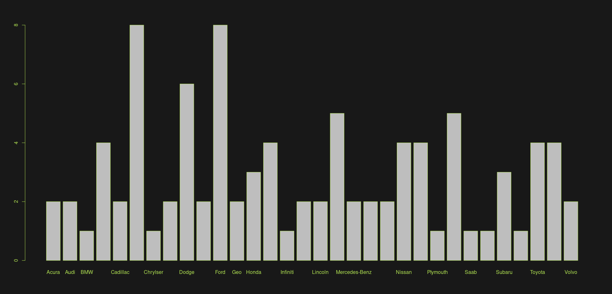
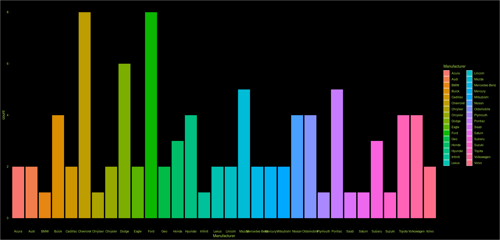

# Analisis CARS99

## Instalación de paquetes necesarios
* La función install.packages("MASS") se utiliza para instalar el paquete MASS. Esta función descarga e instala el paquete en la biblioteca de R.
* Las funciones library() se utilizan para cargar los paquetes previamente instalados en la sesión actual. Los paquetes MASS, descr, ggplot2 y forcats se utilizan comúnmente en el análisis y visualización de datos.

```
install.packages("MASS")
library(MASS)
library(descr)
library(ggplot2)
library(forcats)
```

## Lectura del conjunto de datos
* Este comando lee un archivo CSV llamado "dataset-83422.csv" y lo carga en un objeto de R llamado "base_carros". El archivo CSV debe estar en la misma ubicación que el script de R desde donde se está ejecutando este comando. Una vez que se ha cargado el archivo CSV, se pueden realizar diversas operaciones en los datos utilizando el objeto "base_carros".

```
base_carros = read.csv("dataset-83422.csv")
```

[Ver Tabla](./TablaCars99.md)

## Frecuencias

### Frecuencia absoluta
* El código está calculando la frecuencia absoluta de la variable "Manufacturer" en un conjunto de datos llamado "base_carros". La función "table" crea una tabla de frecuencias para una variable dada, y en este caso, se está pasando como argumento la columna "Manufacturer" del conjunto de datos. La salida de este código es la tabla de frecuencias absolutas de la variable "Manufacturer", es decir, el número de veces que aparece cada valor de "Manufacturer" en el conjunto de datos.

```
frec_abs = table(base_carros$Manufacturer)
frec_abs
```

### Frecuencia relativa
* La función prop.table() en R se utiliza para calcular las frecuencias relativas de una tabla o matriz. En este caso, frec_abs es la tabla de frecuencias absolutas que se ha calculado previamente utilizando la función table(). La función prop.table(frec_abs) toma la tabla de frecuencias absolutas frec_abs y calcula las frecuencias relativas de cada valor en la tabla. El resultado es una tabla de frecuencias relativas que indica la proporción de veces que aparece cada valor en la variable.

```
frec_rel = prop.table(frec_abs)
frec_rel
```

### Tabla de frecuencias
* La función freq() pertenece al paquete descr y se utiliza para crear una tabla de frecuencias de una variable categórica. En este caso, se está aplicando esta función a la variable Manufacturer del conjunto de datos base_carros. Además, se especifica el argumento plot = TRUE para que se genere un gráfico de barras que muestre la distribución de frecuencias de la variable. La variable frec_tabla guarda el resultado de la función freq(), es decir, la tabla de frecuencias y el gráfico de barras.

```
par(col.axis = "#b5e853", bg="#000000e6", fg="#b5e853", col="#b5e853")
frec_tabla = freq(base_carros$Manufacturer, plot = TRUE)
frec_tabla
```
* #### Plot tabla de frecuencias


## Gráfica de barras *ggplot2*

### Gráfica de barras frecuencia absoluta
* Este código en R utiliza la librería ggplot2 para crear un gráfico de barras de las frecuencias absolutas de una variable cualitativa llamada Manufacturer en un conjunto de datos llamado base_carros. La función geom_bar se utiliza para crear un gráfico de barras, donde se define el mapeo de datos para el eje x, que en este caso es el nombre de los fabricantes, utilizando la función aes que toma como argumento x = Manufacturer. No se especifica la altura de cada barra, por lo que por defecto se muestra la frecuencia absoluta de cada fabricante.

```
ggplot(data = base_carros) + 
  geom_bar(mapping = aes(x = Manufacturer, fill=Manufacturer))+
  theme(panel.background = element_rect(fill = "#000000e6"),
        plot.background = element_rect(fill = "#000000e6"),
        panel.grid.major = element_line(color = "#000000e6"),
        panel.grid.minor = element_line(color = "#000000e6"),
        axis.text = element_text(color = "#b5e853"),
        axis.title = element_text(color = "#b5e853"),
        legend.background = element_rect(fill = "#000000e6"),
        legend.text = element_text(color = "#b5e853"),
        legend.title = element_text(color = "#b5e853"),)
```
* #### ggplot barras frecuencia absoluta


### Gráfica de barras frecuencia relativa


# El código utiliza el paquete ggplot2 para crear una gráfica de barras con las 
# frecuencias relativas de los fabricantes de carros en el dataset base_carros. 
# La función geom_bar() es usada para crear una gráfica de barras, donde se 
# define el mapeo de datos para el eje x, que en este caso es el nombre de los 
# fabricantes, y el eje y es la frecuencia relativa de cada fabricante. 
# El argumento stat(prop) es utilizado para indicar que la altura de cada barra 
# debe ser proporcional a la frecuencia relativa de cada fabricante.
ggplot(data = base_carros) + 
  geom_bar(mapping = aes(x = Manufacturer, y = stat(prop), group = 1))

# Grafica de barras que muestra la proporción de una variable categórica (Manufacturer).
# La función fct_reorder() de la librería forcats se utiliza para ordenar las categorías por longitud.
# La función stat(prop) para mostrar la proporción en lugar del recuento.
ggplot(data = base_carros) + 
  geom_bar(mapping = aes(x = fct_reorder(Manufacturer,Manufacturer,length), y = stat(prop), group = 1))
